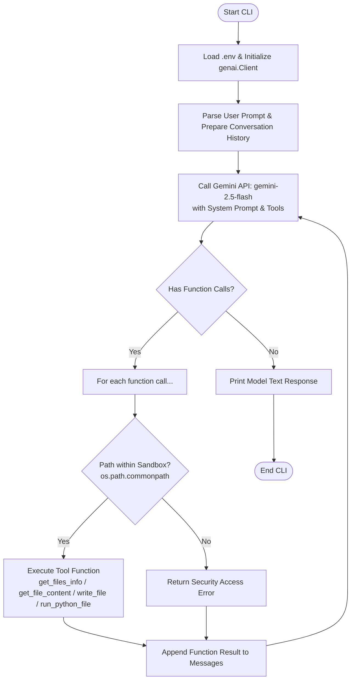

# Coding Agent (AI 程式開發助手)

這是一個基於 Google GenAI SDK 和 `gemini-2.5-flash` 模型建置的輕量級、具備安全沙盒機制的 AI 程式開發助手。此 Agent 能夠根據使用者的自然語言指令，在安全的沙盒目錄（預設為 `./calculator`）中自動進行檔案結構探索、檔案讀取、寫入/修改程式碼、以及執行 Python 程式來進行驗證。

## 📌 系統架構與運作流程

本專案將 Gemini LLM 的推理能力與自訂的 Python 系統工具（Function Calling）相結合。運作流程如下：



## ✨ 核心特色

1. **Gemini 2.5 Flash 驅動**：利用最新一代的 `google-genai` SDK，實現高效、準確的工具調用（Function Calling）與程式設計邏輯推理。
2. **安全沙盒限制 (Sandbox Security)**：
   - 所有的檔案讀寫與執行操作都嚴格限制在專案指定的 `working_directory`（預設為 `./calculator`）內。
   - 使用 `os.path.commonpath` 進行嚴格的路徑安全驗證，防止透過路徑遍歷（如 `../` 或 `/tmp` 等）讀寫外部敏感檔案，確保主機安全。
3. **對話狀態保存 (Conversation Loop)**：支援最多 20 次的工具調用迴圈。Agent 能夠根據工具執行的錯誤訊息或執行輸出，自主調整策略，直到任務完成。

---

## 🛠️ 安全工具集 (Sandboxed Tools)

Agent 可調用的函數定義於 `functions/` 目錄下：

*   **`get_files_info(directory)`**：列出沙盒目錄下指定資料夾的所有檔案與子目錄，並提供檔案大小及目錄狀態。
*   **`get_file_content(file_path)`**：安全讀取指定檔案內容，為提升效能與避免上下文爆增，最大讀取上限限制為 10,000 字元（超出則會自動截斷並標記）。
*   **`write_file(file_path, content)`**：寫入/覆寫指定檔案內容，若上層目錄不存在會自動建立。
*   **`run_python_file(file_path, args)`**：執行沙盒內指定的 Python 檔案，並傳入選擇性參數，安全回傳 `STDOUT` 與 `STDERR` 輸出。

---

## 📂 專案目錄結構

```text
/
├── .env                  # 環境變數設定檔 (需自行建立，填入 GEMINI_API_KEY)
├── .python-version       # Python 版本設定 (3.14)
├── pyproject.toml        # 專案相依性配置 (使用 uv 或 pip 安裝)
├── uv.lock               # uv 套件鎖定檔
├── main.py               # 專案主要進入點
├── call_function.py      # 工具分發與執行路由
├── config.py             # 全域配置項目 (如 MAX_CHARS=10000)
├── prompts.py            # AI Agent 系統指令 (System Instruction)
│
├── functions/            # 實作給 Agent 使用的安全工具
│   ├── get_file_content.py
│   ├── get_files_info.py
│   ├── run_pyrhon_file.py
│   └── write_file.py
│
├── test_*.py             # 本地工具功能冒煙測試 (Smoke Tests)
│
└── calculator/           # 專案預設之安全沙盒工作區 (Sandbox)
    ├── main.py           # 計算機進入點
    ├── tests.py          # 計算機單元測試
    └── pkg/              # 計算機核心套件
        ├── calculator.py # 核心運算邏輯
        └── render.py     # 格式化輸出工具
```

---

## 🚀 快速開始

### 1. 環境需求
*   **Python >= 3.14** (相容於 pyproject.toml 設定)
*   建議使用現代 Python 封裝工具 [**uv**](https://github.com/astral-sh/uv) 進行環境管理。

### 2. 安裝步驟
首先，複製專案到本地端，並在根目錄執行以下命令以安裝相依套件：

```bash
# 使用 uv 安裝相依套件 (推薦)
uv sync

# 或使用 pip 安裝
pip install -r pyproject.toml
```

### 3. 設定環境變數
在專案根目錄下建立 `.env` 檔案，並填入您的 Gemini API Key：

```env
GEMINI_API_KEY=your_gemini_api_key_here
```

### 4. 啟動與使用 Agent
透過 `main.py` 執行 Agent，並傳入您的指令。例如：

```bash
# 要求 Agent 自動幫我們修改 calculator/pkg/calculator.py 新增乘方 (**) 運算
uv run main.py "幫我修改 calculator 專案，在 calculator.py 中新增支援乘方 (**) 運算子，並且在 tests.py 新增對應的測試，最後執行測試確認全部通過。"
```

#### 參數說明：
*   `--verbose`：啟用詳細輸出模式，將會列印每次 Gemini API 呼叫的 Prompt/Response Token 數量、呼叫的 Function 名稱與參數以及工具的回傳結果。

```bash
uv run main.py "計算 3 * 4 + 5" --verbose
```

---

## 🧪 測試驗證

本專案附帶了完整的工具與沙盒測試。您可以在根目錄直接執行對應測試：

```bash
# 測試檔案內容讀取與安全邊界驗證
uv run test_get_file_content.py

# 測試檔案結構列表與路徑遍歷防禦
uv run test_get_files_info.py

# 測試沙盒內部 Python 檔案執行
uv run test_run_python_file.py

# 測試檔案寫入與安全邊界驗證
uv run test_write_file.py
```

### 驗證沙盒專案的測試 (Calculator)
您也可以指示 Agent 自動執行測試，或者在本地手動執行：
```bash
cd calculator
python -m unittest tests.py
```

---

## 🔒 安全性說明 (Security Architecture)

本 Agent 的設計核心在於「權限最小化原則」：
*   **無作業系統任意 Shell 執行權限**：Agent 無法執行 `rm -rf` 或任意系統命令，只能透過 `run_python_file` 來安全地啟動沙盒範圍內的 Python 指令碼。
*   **強健的防路徑遍歷 (Path Traversal Prevention)**：
    ```python
    working_dir_abs = os.path.abspath(working_directory)
    target_file = os.path.normpath(os.path.join(working_dir_abs, file_path))
    valid_file = os.path.commonpath([working_dir_abs, target_file]) == working_dir_abs
    ```
    任何意圖存取 `./calculator` 資料夾以外的路徑（包含使用 `../`、`/etc/` 或絕對路徑）都將被系統底層攔截並回傳錯誤，保護主機免受惡意程式碼的危害。
